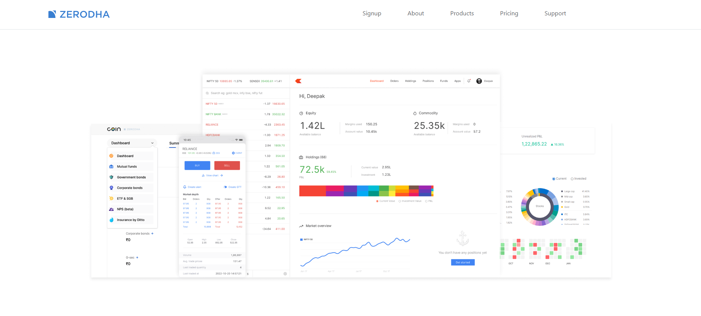
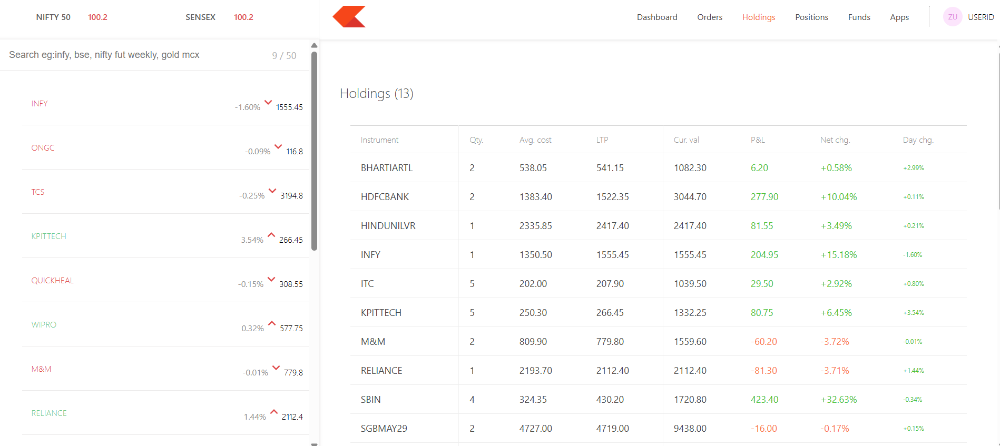

# Zerodha Clone - MERN Stack Project

This is a full-stack web application that replicates the core UI and basic features of [Zerodha](https://zerodha.com/) – India's leading stock trading platform. This clone was built using the **MERN stack**: MongoDB, Express.js, React.js, and Node.js.

> ⚠️ This is a **personal practice project** made for educational purposes only. It does **not perform real stock trading** and is not affiliated with Zerodha.

---

## 🚀 Tech Stack

- **Frontend**: React.js (with React Router), Tailwind CSS (or basic CSS depending on your setup)
- **Backend**: Node.js with Express.js
- **Database**: MongoDB
- **Package Manager**: npm
- **Deployment**: GitHub (code only);

---

## 📁 Folder Structure

```
/frontend    → React application (Zerodha UI)
/dashboard   → Holdings (React-based)
/backend     → Express server with REST APIs and MongoDB
```

---

## ✨ Features

- 📊 **Holdings Page**: Displays current stock holdings with company names, current price, investment value, and gain/loss stats.
- 💸 **Fund Page**: Basic structure for displaying available funds and transaction history (UI only).
- 🧑‍💻 **Login/Signup UI**: Clean frontend forms for user authentication (no actual auth implemented unless added).
- 📂 **Admin Dashboard**: A separate frontend to manage data (like adding stocks/funds) for simulation purposes.
- 🎨 **Responsive UI**: Fully responsive layout for desktop and mobile screens.
- 🌐 **API Integration**: Backend REST APIs built using Express and connected to MongoDB.

---

## 🔧 How to Run Locally

1. **Clone the Repository**

```bash
git clone https://github.com/your-username/actual_zerodha.git
cd actual_zerodha
```

2. **Install Dependencies**

```bash
# For backend
cd backend
npm install

# For frontend
cd ../frontend
npm install

# For dashboard
cd ../dashboard
npm install
```

3. **Run the Application**

```bash
# Start backend server
cd backend
node index.js

# Start frontend
cd ../frontend
npm start

# Start dashboard (optional)
cd ../dashboard
npm start
```

---

## 🧪 Optional: Environment Variables

Create a `.env` file in your backend directory:

```env
MONGO_URI=your_mongodb_connection_string
PORT=any_port
```

---

## UI Screenshots

### Dashboard Page


### Holdings Page


---


## 🧠 Learnings

- Understood how a full MERN stack application is structured and deployed.
- Practiced React components, hooks (`useState`, `useEffect`) and React Router.
- Learned how to create and connect REST APIs with MongoDB using Express.
- Gained experience in managing a codebase with multiple sub-projects.

---

## 📌 Future Improvements

- Add authentication (JWT)
- Enable real-time stock price fetching via external APIs
- Deploy the frontend & backend using Netlify + Render or Vercel

---

## 🤝 Acknowledgements

This project was inspired by Zerodha's design and user experience. All product names, logos, and brands are property of their respective owners.

---

## 📍 Project Status

✅ Frontend - Complete  
✅ Backend - Basic APIs Done  
✅ Admin Dashboard - Basic UI Complete  
🚧 Deployment - Under progress

---

## 📫 Contact

For suggestions or collaborations: [faruqkhanshired111@gmail.com]

---

Made by FaruqKhan
=======
# Zerodha
>>>>>>> 2dda14442af23dad143fa1bdb114df131191753a
